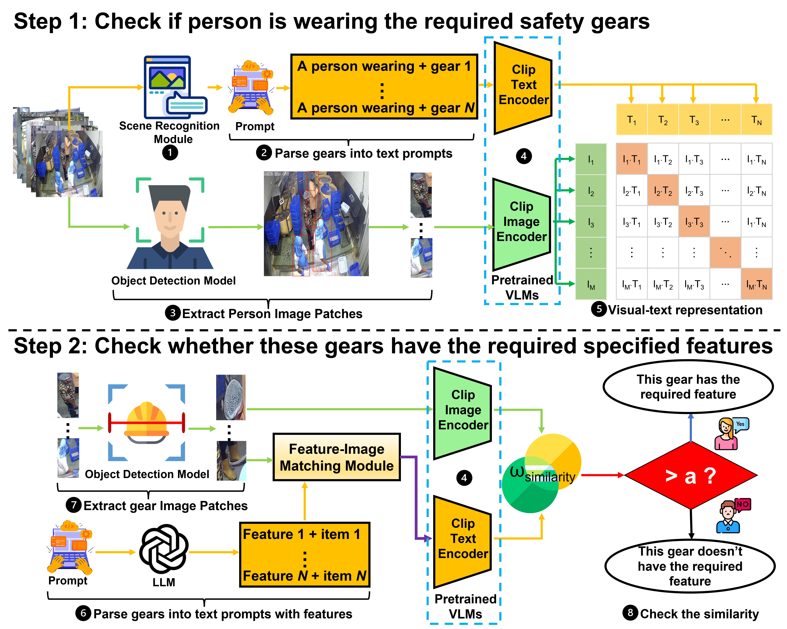

# Clip2Safety: Vision Language Model for Interpretable and Fine-grained Detection of Safety Compliance in Diverse Workplaces
This is the official implementation of paper "Vision Language Model for Interpretable and Fine-grained Detection of Safety Compliance in Diverse Workplaces".

> Zhiling Chen*, Hanning Chen, Mohsen Imani, Ruimin Chen, Farhad Imani.
>
> Paper Link: https://arxiv.org/pdf/2408.07146

## Overview




## Citation
```
@article{chen2024vision,
  title={Vision Language Model for Interpretable and Fine-grained Detection of Safety Compliance in Diverse Workplaces},
  author={Chen, Zhiling and Chen, Hanning and Imani, Mohsen and Chen, Ruimin and Imani, Farhad},
  journal={arXiv preprint arXiv:2408.07146},
  year={2024}
}
```

